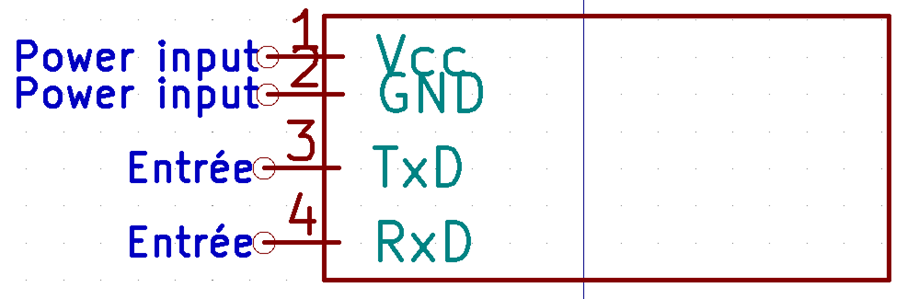
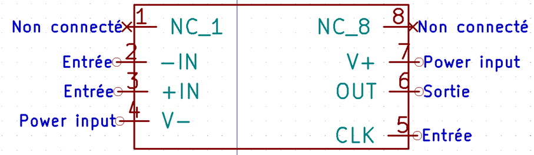
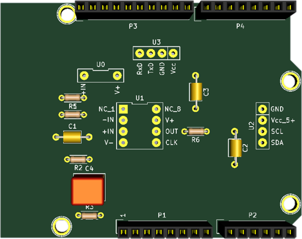

# 2020_2021_DERGICI_LOISON

## Plan du Projet Capteur

  - [1. Description](#1-description)
  - [2. Liste des livrables](#2-liste-des-livrables)
  - [3. KiCAD PCB shield - Livrable 1](#3-kicad-pcb-shield---livrable-1)
    - [3.1 Présentation des symboles KiCAD créés](#31-présentation-des-symboles-kicad-créés)
    - [3.2 Rendu 3D du shield designé](#32-rendu-3d-du-shield-designé)
  - [4. Code Arduino - Livrable 2](#4-code-arduino---livrable-2)
  - [5. APK Android interface - Livrable 3](#5-apk-android-interface---livrable-3)
    - [5.1 Notre application: Capteur_Graphite_SDML](#51-notre-application-capteur_graphite_sdml)
    - [5.2 Interface de Capteur_Graphite_SDML](#52-interface-de-capteur_graphite_sdml)
  - [6. Datacheet du capteur - Livrable 4](#6-datacheet-du-capteur---livrable-4)
  - [7. Protocole du banc de test - Livrable 5](#7-protocole-du-banc-de-test---livrable-5)
  - [8. Pistes des améliorations possibles](#8-pistes-des-améliorations-possibles)

## 1. Description 

Ce projet s'inscrit dans l'enseignement de 4éme année génie physique de l'UF "du Banc de Test au Capteur".
Le capteur à réaliser est comparable à une jauge de contrainte à base de graphite.
Le projet comprend:
 - le design et la fabrication d'un PCB shield, 
 - le couplage de la jauge à un circuit analogique, 
 - la communication via un microcontrôleur avec une application Android. 

## 2. Liste des livrables

- [x] KiCAD PCB shield: transimpedance amplifier, BT module, OLED screen
- [x] Code Arduino: mesure jauge contrainte & contrôle communication BT/affichage sur l'OLED
- [x] APK Android interface sur MIT App Inventor: évolution de la valeur de la résistance
- [x] Datasheet du capteur
- [x] Protocole du banc test

Tous les livrales ont été réalisés et sont disponibles sur la plateforme GitHub.

## 3. KiCAD PCB shield - Livrable 1

- PCB simple face designé sur KiCAD :
  - schematics: création d'une biblihothèque dédiée au projet et de nouveaux symboles pour représenter tous les éléments du shield.
  - PCB: routage du circuit transimpédance et des éléments permettant la mesure (module BT, OLED), création des empreintes associées à tous les éléments du shield.
- Accès possible sur GitHub aux fichiers Gerber, à la représentation 3D du shield ainsi qu'aux pdf des pistes

### 3.1 Présentation des symboles KiCAD créés

#### Symbole créé pour le capteur graphite

#### Symbole créé pour l'écran OLED

#### Symbole créé pour le module BlueTooth

#### Symbole créé pour l'ampli LTC1050

### 3.2 Rendu 3D du shield designé

#### Représentation 3D du shield

## 4. Code Arduino - Livrable 2

- Le code Arduino permet la communication avec le téléphone portable (réception et envoi de données sous forme de bit), sur la base d'une machine à états il gère ensuite les différents cas de figure possibles.
Trois cas de figures simples ont été imaginés :
   - début de mesure et d'acquisition (correspond au case action=1): lance la mesure et la sauvegarde des données d'ADC et de résistance, affichage de la valeur de résistance sur l'OLED et l'application, graphe de l'appli suit l'évolution des variations de résistance.
   - fin de mesure et arrêt de l'acquisition (correspond au case action=2): arrête la mesure et met fin à la sauvegarde des données qui sont dès lors accessibles sur le téléphone.
   - default case: gère le cas où action a une valeur anormale (différente de 1 ou 2).
  
- Il traduit la valeur en ADC en valeur de résistance, selon l'équation du circuit établie. Pour éviter les erreurs dues à une mauvaise écriture de l'équation (trop ou pas assez de parenthèses) les déterminants, numérateurs et autres ont été préalablement calculés et une variable leur a été affectée.
- Il gère aussi l'affichage des valeurs de résistance sur l'OLED pendant la mesure, et gère l'arrêt de mesure avec l'affichage de l'écran d'accueil sur l'OLED

## 5. APK Android interface - Livrable 3

### 5.1 Notre application: Capteur_Graphite_SDML
- L'application nommée "Capteur_Graphite_SDML" se connecte par bluetooth au capteur 
- L'état de la connexion s'affiche ainsi que le nom de l'appareil connecté
- Mesure la valeur de la résistance selon la déformation appliquée sur le capteur et l'affiche
- Trace le graphique en temps réel des valeurs d'ADC mesurées (choix de l'ADC et non de la résistance pour le graph. car l'ADC varie moins fortement que la résistance)
- Les données sont sauvegardées sous le nom entré par l'utilisateur et accessibles depuis le téléphone 
- L'arrêt de la mesure est annoncé par l'application (déclenche un message vocal)

### 5.2 Interface de Capteur_Graphite_SDML

## 6. Datacheet du capteur - Livrable 4

- Description du capteur et de l'application associée,
- Dimensions du capteur et exemple d'utilisation,
- Présentation du banc de test,
- Caractéristiques techniques et électriques,
- Caractéristiques (Variation de résistance/Déformation).

## 7. Protocole du banc de test - Livrable 5

- On utilise un banc de test demi-circulaire des portions de différents rayons. 
- Les rayons sont compris entre 1 cm et 2.5 cm avec un intervalle de 0.25cm. 
- Chaque rayon est associé à une déformation max applicable au capteur graphite.
- La déformation peut être "interne" ou "externe" en fonction du positionnement du capteur. 
- Une petite fente présente a chaque début de courbure permet de coincer l'extrémité du capteur, ce qui permet de bien épouser la surface du banc de test. 
- Pour une meilleure durée de vie du capteur il est préférable de commencer par les rayons les plus grands (torsion et risque de casse du capteur moins)
- À chaque test, les données (la clock, la valeur de la résistance et la valeur de l'ADC) sont enregistrées dans un fichier texte sur le téléphone (nom typique: "myFile_typeCrayon_rayon.txt").
- Une fois tous les tests effectués selon les différents rayons et selon le type de crayon choisi, les données sont traitées.

## 8. Pistes des améliorations possibles

- Le capteur se détériore trop rapidement et on observe une faible reproductibilité des expériences, il est rare de retrouver les même valeurs de résistance pour un même crayon. Chaque capteur est unique même en utilisant un même type de crayon. En effet, tout dépend de la quantité de graphite que l'on dépose sur le capteur.  
- Difficultés à détecter les valeurs de résistance des crayons du type H. Leur résistance est trop grande, pour mieux les détecter il faudrait mettre des résistances en parallèle. 
